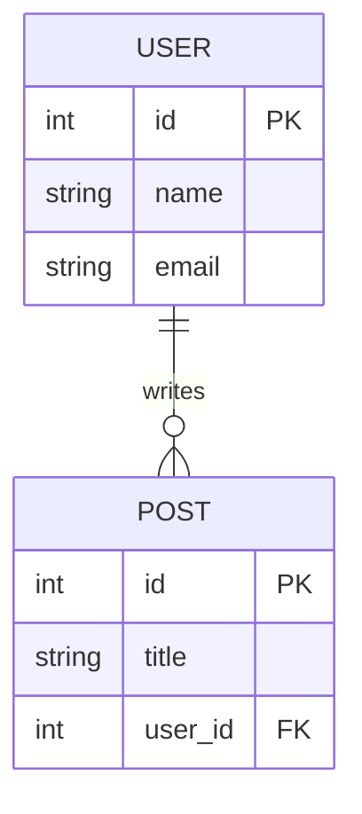

# 아키텍처 설계

> [!NOTE]
> 이 문서에서 아키텍처를 설계하세요. 수립된 계획의 핵심 요약은 `project-summary.md` 파일에 기록합니다. 계획을 세우기 전에 `project-summary.md`를 참고하여 전체 프로젝트의 맥락을 파악하세요.
> [!TIP]
> Mermaid.js 문법을 사용하면 텍스트만으로 ERD, 시퀀스 다이어그램 등 다양한 다이어그램을 문서에 직접 포함시킬 수 있습니다.

## [AI] 디렉토리 구조

- 프로젝트의 최상위 폴더 및 파일 구조를 서술하세요. (예: `/src`, `/components`, `/server`, `/db` 등)

## [AI] 데이터베이스 스키마

- 엔터티 목록과 관계도를 서술하거나 Mermaid.js를 사용하여 ER 다이어그램을 작성하세요.
- 필드, 타입, 제약 조건을 표로 정리하면 추후 구현에 도움이 됩니다.

**예시 (Mermaid ERD):**

## [AI] 인증 및 인가 흐름

- 로그인, 회원가입, 소셜 로그인, 세션 관리, 권한 부여 등 인증/인가와 관련된 전체적인 흐름을 서술하세요.
- 필요하다면 Mermaid.js를 사용하여 시퀀스 다이어그램으로 표현하세요.

## [AI] API 엔드포인트

| 메서드 | 경로 | 설명 | 요청 본문/쿼리 | 응답 |
| --- | --- | --- | --- | --- |
| | | | | |
| | | | | |

> 기능이 확정되면 엔드포인트를 계속 추가하고, 변경 시에는 `project-summary.md`의 아키텍처 요약도 함께 업데이트하세요.

## [AI] 주요 컴포넌트 설계 (프론트엔드)

- 재사용 가능성이 높은 핵심 UI 컴포넌트(예: Button, Modal, Card)의 `props`와 `state`를 정의하세요.
- 주요 페이지들의 컴포넌트 계층 구조를 서술하세요.
- 전역 상태 관리(Global State Management)가 필요하다면, 어떤 상태를 어떻게 관리할지 방향을 서술하세요.
